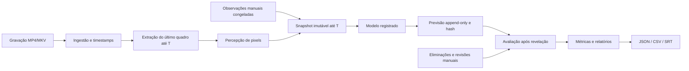

# Arquitetura

Na versão 0.3, `provenance.py` valida a identidade de origem e o split em uma transação de importação. O baseline histórico verifica novamente a origem na criação do experimento. `playback.py` prepara cópias locais H.264/AAC com PTS normalizado para anotação, em no máximo duas tarefas; essas cópias nunca substituem o arquivo usado pela inferência. Novos vídeos usam duração relativa ao primeiro quadro e ao fim do último, sem incluir áudio posterior.

Novos experimentos incluem `memory_seconds` (padrão 60, entre 10 e 600) no contrato persistido. O snapshot retém apenas observações no intervalo `[T-memory_seconds,T]`. Configurações legadas sem o campo conservam a política original. O heurístico continua usando risco recente de até 10s. A inferência nunca recebe os outcomes usados pelo gerador offline em `research/export_dataset.py`.

As versões de relatório têm IDs locais e exportação selecionável. A comparação pareada verifica integridade, atualização e igualdade de anotação, usando a interseção `(timestamp,horizon)` da mesma gravação. Backup usa `sqlite3.Connection.backup`, copia os vídeos referenciados e valida hashes antes de publicar uma pasta nova; restauração não sobrepõe diretórios existentes.

O backend FastAPI é um processo local, com SQLite para persistência e FFmpeg/FFprobe para leitura. O frontend compilado é servido no mesmo endereço; o Vite faz proxy em desenvolvimento. Sem serviços distribuídos, GPU ou conexão externa obrigatória.

## Contratos e responsabilidades

`contracts.py` valida entradas, números finitos e a distribuição das probabilidades. `video.py` valida vídeos com ferramentas externas e encontra o quadro com timestamp menor ou igual ao corte, usando o índice de apresentação do frame. `NaN` e infinitos são recusados antes de consultar o cache ou decodificar. O relógio analítico começa no primeiro quadro apresentado, normalizado em 0s; gravações com offsets incomuns merecem conferência manual de sincronização.

`frames.py` mantém até duas sessões FFmpeg, serializa consultas e lê frames sequenciais RGB em uma fila limitada. A saída é normalizada para 640×360 com letterbox, preservando a proporção; o PNG é produzido somente para o índice autorizado. O cache LRU contém até 64 frames solicitados. Cada consulta valida o corte antes de buscar o cache. A extração isolada em `video.py` permanece como referência para comparação de pixels.

O decodificador pode pré-carregar frames técnicos numa fila privada, assim como o arquivo integral já existe no disco. Essa fila nunca entra no contexto de inferência. O modelo só recebe observações do frame selecionado até T. Threads, pipes e processos são encerrados no shutdown, em falhas ou quando a sessão é descartada. Retornar a um índice fora do cache reinicia a leitura. `GET /api/health` expõe contadores de sessões, cache e frames consumidos pelo Python; esses contadores não medem todo o trabalho interno do codec.

`temporal.py` cria dataclasses congeladas e elimina observações posteriores ao corte. Nenhuma nota livre, evento, revisão, conexão de banco ou caminho entra no modelo. O contexto permite consultas ao passado e rejeita consultas além de T. A percepção atual mede luminância; semântica fica explicitamente desconhecida.

`models.py` contém modelos determinísticos e o contrato `PredictionModel`. O modelo histórico recebe somente contagens congeladas de partidas de treinamento. `experiments.py` controla a ordem dos instantes, captura a configuração, observa frames progressivamente e grava previsões numa transação serializada.

`storage.py` oferece consultas parametrizadas, triggers que recusam UPDATE/DELETE de previsões e hashes encadeados sobre JSON canônico. Cada contexto usado é copiado para o registro, permitindo verificar a ausência de observações futuras e inspecionar a evidência original. Anotações e metadados do vídeo ficam em tabelas separadas.

Correções ficam em `annotation_revisions`, também append-only, com cadeia de hashes por anotação. O registro original representa a revisão zero. Consultas retornam a versão efetiva, omitindo anotações retiradas; a exportação conserva o histórico. Uma transação `BEGIN IMMEDIATE` compara `expected_revision` antes de gravar e retorna HTTP 409 se outra operação venceu. A leitura do conjunto de anotações usa uma transação consistente. Experimentos anteriores não consultam as revisões de observações; avaliações posteriores usam as revisões de resultados.

`evaluation.py` resolve resultados exclusivamente depois da previsão. Cada revelação grava uma revisão do relatório com hash das anotações e o head da cadeia de previsões. `export.py` sincroniza as previsões no relógio do vídeo; SRT contém apenas a informação disponível no instante da previsão. JSON/CSV distinguem `generated_at` e `revealed_at`.

`report-status` compara o snapshot do relatório com os valores efetivos atuais, sem modificar o relatório. `reports` oferece todas as revisões persistidas. O dashboard marca comparações desatualizadas e pede nova revelação. O componente de gráficos é carregado somente quando necessário, em um bundle separado.

## Segurança local

Uploads usam nomes gerados pelo servidor, leitura em blocos e limite configurável. Extensão é restrita, conteúdo é inspecionado pelo FFprobe e nenhum comando usa shell. Host e Origin são restringidos a localhost. Arquivos não confiáveis continuam sendo processados por parsers externos: mantenha FFmpeg atualizado e utilize gravações autorizadas.

Banco e mídia ficam em `ANYA_DATA_DIR` e são ignorados pelo Git. Os binários não enviam vídeos a APIs. O servidor escuta 127.0.0.1 por padrão. Não exponha essa instância à internet: autenticação, multitenancy e administração remota não fazem parte do MVP.

O armazenamento de todos os timestamps é metadado técnico, não inferência sobre acontecimentos futuros. O vídeo integral existe para reprodução e avaliação; somente o snapshot limitado é entregue ao modelo. O protocolo não executa plugins de terceiros nem oferece isolamento de processo contra modelos hostis.
