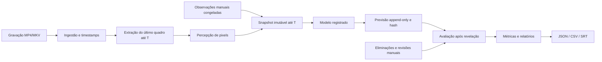

# Arquitetura

O backend FastAPI é um processo local, com SQLite para persistência e FFmpeg/FFprobe para leitura. O frontend compilado é servido no mesmo endereço; o Vite faz proxy em desenvolvimento. Sem serviços distribuídos, GPU ou conexão externa obrigatória.

## Contratos e responsabilidades

`contracts.py` valida entradas, números finitos e a distribuição das probabilidades. `video.py` valida vídeos com ferramentas externas e encontra o quadro com timestamp menor ou igual ao corte, usando o índice de apresentação do frame. O relógio analítico começa no primeiro quadro apresentado, normalizado em 0s; gravações com offsets incomuns merecem conferência manual de sincronização.

`temporal.py` cria dataclasses congeladas e elimina observações posteriores ao corte. Nenhuma nota livre, evento, revisão, conexão de banco ou caminho entra no modelo. O contexto permite consultas ao passado e rejeita consultas além de T. A percepção atual mede luminância; semântica fica explicitamente desconhecida.

`models.py` contém modelos determinísticos e o contrato `PredictionModel`. O modelo histórico recebe somente contagens congeladas de partidas de treinamento. `experiments.py` controla a ordem dos instantes, captura a configuração, observa frames progressivamente e grava previsões numa transação serializada.

`storage.py` oferece consultas parametrizadas, triggers que recusam UPDATE/DELETE de previsões e hashes encadeados sobre JSON canônico. Cada contexto usado é copiado para o registro, permitindo verificar a ausência de observações futuras e inspecionar a evidência original. Anotações e metadados do vídeo ficam em tabelas separadas.

`evaluation.py` resolve resultados exclusivamente depois da previsão. Cada revelação grava uma revisão do relatório com hash das anotações e o head da cadeia de previsões. `export.py` sincroniza as previsões no relógio do vídeo; SRT contém apenas a informação disponível no instante da previsão. JSON/CSV distinguem `generated_at` e `revealed_at`.

## Segurança local

Uploads usam nomes gerados pelo servidor, leitura em blocos e limite configurável. Extensão é restrita, conteúdo é inspecionado pelo FFprobe e nenhum comando usa shell. Host e Origin são restringidos a localhost. Arquivos não confiáveis continuam sendo processados por parsers externos: mantenha FFmpeg atualizado e utilize gravações autorizadas.

Banco e mídia ficam em `ANYA_DATA_DIR` e são ignorados pelo Git. Os binários não enviam vídeos a APIs. O servidor escuta 127.0.0.1 por padrão. Não exponha essa instância à internet: autenticação, multitenancy e administração remota não fazem parte do MVP.

O armazenamento de todos os timestamps é metadado técnico, não inferência sobre acontecimentos futuros. O vídeo integral existe para reprodução e avaliação; somente o snapshot limitado é entregue ao modelo. O protocolo não executa plugins de terceiros nem oferece isolamento de processo contra modelos hostis.
